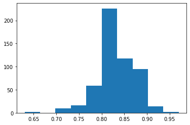

<style>
.icon:hover {
  opacity: 0.7;
}
</style>
<script src="https://cdnjs.cloudflare.com/ajax/libs/font-awesome/6.0.0/css/all.min.css"></script>
<i class="fa-brands fa-github"></i>
<a href="https://www.linkedin.com/in/joel-montavon-704808a/" target="_blank"></img></a>
<svg xmlns="http://www.w3.org/2000/svg" viewBox="0 0 496 512"><!--! Font Awesome Pro 6.0.0 by @fontawesome - https://fontawesome.com License - https://fontawesome.com/license (Commercial License) Copyright 2022 Fonticons, Inc. --><path d="M165.9 397.4c0 2-2.3 3.6-5.2 3.6-3.3.3-5.6-1.3-5.6-3.6 0-2 2.3-3.6 5.2-3.6 3-.3 5.6 1.3 5.6 3.6zm-31.1-4.5c-.7 2 1.3 4.3 4.3 4.9 2.6 1 5.6 0 6.2-2s-1.3-4.3-4.3-5.2c-2.6-.7-5.5.3-6.2 2.3zm44.2-1.7c-2.9.7-4.9 2.6-4.6 4.9.3 2 2.9 3.3 5.9 2.6 2.9-.7 4.9-2.6 4.6-4.6-.3-1.9-3-3.2-5.9-2.9zM244.8 8C106.1 8 0 113.3 0 252c0 110.9 69.8 205.8 169.5 239.2 12.8 2.3 17.3-5.6 17.3-12.1 0-6.2-.3-40.4-.3-61.4 0 0-70 15-84.7-29.8 0 0-11.4-29.1-27.8-36.6 0 0-22.9-15.7 1.6-15.4 0 0 24.9 2 38.6 25.8 21.9 38.6 58.6 27.5 72.9 20.9 2.3-16 8.8-27.1 16-33.7-55.9-6.2-112.3-14.3-112.3-110.5 0-27.5 7.6-41.3 23.6-58.9-2.6-6.5-11.1-33.3 2.6-67.9 20.9-6.5 69 27 69 27 20-5.6 41.5-8.5 62.8-8.5s42.8 2.9 62.8 8.5c0 0 48.1-33.6 69-27 13.7 34.7 5.2 61.4 2.6 67.9 16 17.7 25.8 31.5 25.8 58.9 0 96.5-58.9 104.2-114.8 110.5 9.2 7.9 17 22.9 17 46.4 0 33.7-.3 75.4-.3 83.6 0 6.5 4.6 14.4 17.3 12.1C428.2 457.8 496 362.9 496 252 496 113.3 383.5 8 244.8 8zM97.2 352.9c-1.3 1-1 3.3.7 5.2 1.6 1.6 3.9 2.3 5.2 1 1.3-1 1-3.3-.7-5.2-1.6-1.6-3.9-2.3-5.2-1zm-10.8-8.1c-.7 1.3.3 2.9 2.3 3.9 1.6 1 3.6.7 4.3-.7.7-1.3-.3-2.9-2.3-3.9-2-.6-3.6-.3-4.3.7zm32.4 35.6c-1.6 1.3-1 4.3 1.3 6.2 2.3 2.3 5.2 2.6 6.5 1 1.3-1.3.7-4.3-1.3-6.2-2.2-2.3-5.2-2.6-6.5-1zm-11.4-14.7c-1.6 1-1.6 3.6 0 5.9 1.6 2.3 4.3 3.3 5.6 2.3 1.6-1.3 1.6-3.9 0-6.2-1.4-2.3-4-3.3-5.6-2z"/></svg>
<a href="https://github.com/joelmontavon/risk-adjustment" target="_blank"></img></a>
<h1>Risk Adjustment for Social Determinants of Health (SDOH)</h1>
<p>This tutorial will explain how to adjust healthcare quality measures for SDOH factors.</p>
<p>For this tutorial, I will use the following publicly available datasets:</p>
<ul>
    <li><b><a href="https://www.cms.gov/files/zip/2022-star-ratings-data-table-oct-06-2021.zip">2022 Star Ratings Data Table</a></b>: CMS publishes the data related to their Star Ratings on their <a href="https://www.cms.gov/Medicare/Prescription-Drug-Coverage/PrescriptionDrugCovGenIn/PerformanceData" target="_blank">Part C and D Performance Data</a> webpage.</li>
    <li><b><a href="https://www.cms.gov/files/zip/monthly-enrollment-cpsc-december-2020.zip">Monthly Enrollment by CPSC – December 2020 (ZIP)</a></b>: CMS publishes data related to enrollment in Medicare contracts on their <a href="https://www.cms.gov/Research-Statistics-Data-and-Systems/Statistics-Trends-and-Reports/MCRAdvPartDEnrolData/Monthly-Enrollment-by-Contract-Plan-State-County" target="_blank">Medicare Advantage/Part D Contract and Enrollment Data</a> webpage.</li>
    <li><b><a href="https://www.ahrq.gov/sites/default/files/wysiwyg/sdohchallenge/data/county_2018.XLSX">Social Determinants of Health (SDOH) Beta Data File</a></b>: The Agency for Healthcare Research and Quality (AHRQ) has published SDOH data on their <a href="https://www.ahrq.gov/sdoh/data-analytics/sdoh-data.html" target="_blank">SDOH Database</a> webpage. The data includes variables related to social context (e.g., age, race/ethnicity, veteran status), economic context (e.g., income, unemployment rate), education, physical infrastructure (e.g, housing, crime, transportation), and healthcare context (e.g., health insurance).</li>
</ul>

<p>First, I'm going to setup a variable with my path so I can read the data into dataframes.</p>


```python
import os

#update with your own path; prefix your string for paths with r in windows
my_path = r'D:\projects\python\risk adj' + os.sep
```

<p>I read the Medicare enrollment data into a dataframe. I need to convert the column with enrollment to numbers, clean up the column names, and limit to rows with some enrollment.</p>


```python
import pandas as pd
import re

def try_number(str):
    try:
        return int(str)
    except:
        return 0

#read the CSV file
enroll = pd.read_csv(my_path + 'CPSC_Enrollment_Info_2020_12.csv', converters={'Enrollment': try_number})
#rename some columns
enroll = enroll.rename(columns=lambda x: re.sub("\s+", "_", re.sub('[^A-Za-z0-9\s]+',' ', x.lower())))
#limit to rows with some enrollment
enroll = enroll[(enroll['enrollment'] != 0)]
```

<p>Take a look at the enrollment data after cleaning it up.</p>


```python
enroll
```


<div>
<style scoped>
    .dataframe tbody tr th:only-of-type {
        vertical-align: middle;
    }

    .dataframe tbody tr th {
        vertical-align: top;
    }

    .dataframe thead th {
        text-align: right;
    }
</style>
<table border="1" class="dataframe">
  <thead>
    <tr style="text-align: right;">
      <th></th>
      <th>contract_number</th>
      <th>plan_id</th>
      <th>ssa_state_county_code</th>
      <th>fips_state_county_code</th>
      <th>state</th>
      <th>county</th>
      <th>enrollment</th>
    </tr>
  </thead>
  <tbody>
    <tr>
      <th>4</th>
      <td>E0654</td>
      <td>801</td>
      <td>1010</td>
      <td>1003.0</td>
      <td>AL</td>
      <td>Baldwin</td>
      <td>12</td>
    </tr>
    <tr>
      <th>72</th>
      <td>E0654</td>
      <td>801</td>
      <td>2020</td>
      <td>2020.0</td>
      <td>AK</td>
      <td>Anchorage</td>
      <td>143</td>
    </tr>
    <tr>
      <th>77</th>
      <td>E0654</td>
      <td>801</td>
      <td>2090</td>
      <td>2090.0</td>
      <td>AK</td>
      <td>Fairbanks North Star</td>
      <td>87</td>
    </tr>
    <tr>
      <th>80</th>
      <td>E0654</td>
      <td>801</td>
      <td>2122</td>
      <td>2122.0</td>
      <td>AK</td>
      <td>Kenai Peninsula</td>
      <td>32</td>
    </tr>
    <tr>
      <th>84</th>
      <td>E0654</td>
      <td>801</td>
      <td>2170</td>
      <td>2170.0</td>
      <td>AK</td>
      <td>Matanuska-Susitna</td>
      <td>58</td>
    </tr>
    <tr>
      <th>...</th>
      <td>...</td>
      <td>...</td>
      <td>...</td>
      <td>...</td>
      <td>...</td>
      <td>...</td>
      <td>...</td>
    </tr>
    <tr>
      <th>3212901</th>
      <td>S9701</td>
      <td>807</td>
      <td>36480</td>
      <td>39093.0</td>
      <td>OH</td>
      <td>Lorain</td>
      <td>18</td>
    </tr>
    <tr>
      <th>3213419</th>
      <td>S9701</td>
      <td>807</td>
      <td>45550</td>
      <td>48167.0</td>
      <td>TX</td>
      <td>Galveston</td>
      <td>11</td>
    </tr>
    <tr>
      <th>3213436</th>
      <td>S9701</td>
      <td>807</td>
      <td>45610</td>
      <td>48201.0</td>
      <td>TX</td>
      <td>Harris</td>
      <td>35</td>
    </tr>
    <tr>
      <th>3213505</th>
      <td>S9701</td>
      <td>807</td>
      <td>45801</td>
      <td>48339.0</td>
      <td>TX</td>
      <td>Montgomery</td>
      <td>15</td>
    </tr>
    <tr>
      <th>3213607</th>
      <td>S9701</td>
      <td>807</td>
      <td>46170</td>
      <td>49035.0</td>
      <td>UT</td>
      <td>Salt Lake</td>
      <td>11</td>
    </tr>
  </tbody>
</table>
<p>155628 rows × 7 columns</p>
</div>


<p>I read the SDOH data into a dataframe and clean up the column names.</p>


```python
#read excel file
sdoh = pd.read_excel(my_path + 'county_2018.XLSX')
#rename some columns
sdoh = sdoh.rename(columns=lambda x: re.sub("\s+", "_", re.sub('[^A-Za-z0-9\s]+',' ', x.lower())))
```

<p>Now, I'm going to identify the variables with at least 90% of the rows populated so I can throw them out.</p>


```python
#perform a count on the variables that I care about; the first and last few rows are identifiers so not included
vars_cnts = sdoh.iloc[:, 5:224].count().reset_index()
#rename the columns
vars_cnts = vars_cnts.rename(columns={'index':'var', 0: 'n'})
#identify variables with at least 90% of the rows populated
vars = vars_cnts[vars_cnts['n'] > (vars_cnts['n'].max() * 0.9)]['var']
#convert to a list
vars = vars.values.tolist()
```

<p>Next, I want to eliminate any variables which are highly correlated. It is easy to create a correlation matrix in pandas using the corr() function. Pearson correlation is used by default.</p>
<p>For a subset of the variables, I have created a heatmap in the correlation matrix to give you an idea what this looks like.</p>


```python
import matplotlib.pyplot as plt
import seaborn as sns

plt.figure(figsize=(15,10))
corrMatrix = sdoh[vars[:10]].corr()
sns.heatmap(corrMatrix, annot=True, cmap=plt.cm.Reds)
plt.show()
```


    

    


<p>Since I have nearly 200 variables, I need to use a programatic approach to eliminating highly correlated variables.</p>


```python
#calculate correlations between variables and reset index
corr = sdoh[vars].corr().reset_index()
#transform variables and their values from columns to rows
corr = pd.melt(corr, id_vars=['index'], var_name='var', value_name='val')
#rename the columns
corr = corr.rename(columns={'index':'var1', 'var':'var2', 'val': 'corr'})
#modify correlations to absolute values
corr['corr'] = corr['corr'].abs()
#no need to include correlations between a variable and itself
corr = corr[corr['var1'] != corr['var2']]
```

<p>Take a look with the resulting dataset with the correlations.</p>


```python
corr
```


<div>
<style scoped>
    .dataframe tbody tr th:only-of-type {
        vertical-align: middle;
    }

    .dataframe tbody tr th {
        vertical-align: top;
    }

    .dataframe thead th {
        text-align: right;
    }
</style>
<table border="1" class="dataframe">
  <thead>
    <tr style="text-align: right;">
      <th></th>
      <th>var1</th>
      <th>var2</th>
      <th>corr</th>
    </tr>
  </thead>
  <tbody>
    <tr>
      <th>1</th>
      <td>nchs_urcs_2006</td>
      <td>ahrf_usda_rucc_2013</td>
      <td>0.842705</td>
    </tr>
    <tr>
      <th>2</th>
      <td>nchs_urcs_2013</td>
      <td>ahrf_usda_rucc_2013</td>
      <td>0.903884</td>
    </tr>
    <tr>
      <th>3</th>
      <td>territory</td>
      <td>ahrf_usda_rucc_2013</td>
      <td>0.164745</td>
    </tr>
    <tr>
      <th>4</th>
      <td>acs_total_pop_wt</td>
      <td>ahrf_usda_rucc_2013</td>
      <td>0.327719</td>
    </tr>
    <tr>
      <th>5</th>
      <td>acs_pct_age_65up</td>
      <td>ahrf_usda_rucc_2013</td>
      <td>0.421954</td>
    </tr>
    <tr>
      <th>...</th>
      <td>...</td>
      <td>...</td>
      <td>...</td>
    </tr>
    <tr>
      <th>34219</th>
      <td>svi_rpl_theme2_hh_disb</td>
      <td>cen_popdensity_2018</td>
      <td>0.116198</td>
    </tr>
    <tr>
      <th>34220</th>
      <td>svi_rpl_theme3_mino</td>
      <td>cen_popdensity_2018</td>
      <td>0.154638</td>
    </tr>
    <tr>
      <th>34221</th>
      <td>svi_rpl_theme4_hh_trans</td>
      <td>cen_popdensity_2018</td>
      <td>0.097194</td>
    </tr>
    <tr>
      <th>34222</th>
      <td>svi_rpl_themes_all</td>
      <td>cen_popdensity_2018</td>
      <td>0.020505</td>
    </tr>
    <tr>
      <th>34223</th>
      <td>cen_arealand_sqm</td>
      <td>cen_popdensity_2018</td>
      <td>0.034135</td>
    </tr>
  </tbody>
</table>
<p>34040 rows × 3 columns</p>
</div>


<p>I need to identify the highly correlated variables and limit to just one of the highly correlated variables. I use the threshold of 0.7 to identify highly correlated variables.</p> 


```python
#create a new dataframe with the variable and its correlations
corr_high = corr[['var1','corr']]
#set n to 0 for all rows and then update rows with correlation > 0.7 to 1
corr_high['n'] = 0
corr_high.loc[corr_high['corr'] > .7,'n'] = 1
#group by variable and count
corr_high = corr_high[['var1','n']].groupby('var1').sum().reset_index()
```

<p>Now, I join with the original dataset with the correlations and sort based upon the count of highly correlated variables.</p>


```python
corr = pd.merge(corr, corr_high, on='var1').sort_values('n')
```

<p>I am almost there. I have sorted based upon the count of highly correlated variables. I now loop thru the variables keeping the first variable and throwing the other variables into a list to be excluded.</p>


```python
#create list to hold the excluded variables
vars_excl = []
#loop thru the rows
for item in corr.values.tolist():
    #append var2 to list if the variables are highly correlated and neither variable is in the list of excluded variables
    if item[2] > 0.7 and not (item[0] in vars_excl) and not (item[1] in vars_excl):
        vars_excl.append(item[1])
```

<p>I create a final dataset from the list of variables after removing those in our list to be excluded.</p>


```python
vars_incl = list(set(vars) - set(vars_excl))
sdoh = sdoh[list(sdoh.iloc[:, :5].columns) + vars_incl]
```

<p>Lastly, I need to deal with missing values to build the model. For missing values, I set the value to the mean for the column.</p>


```python
for col in sdoh.columns[5:]:
    sdoh[col] = sdoh[col].fillna((sdoh[col].mean()))
```

<p>Take a look at the final SDOH dataset.</p>


```python
sdoh
```


<div>
<style scoped>
    .dataframe tbody tr th:only-of-type {
        vertical-align: middle;
    }

    .dataframe tbody tr th {
        vertical-align: top;
    }

    .dataframe thead th {
        text-align: right;
    }
</style>
<table border="1" class="dataframe">
  <thead>
    <tr style="text-align: right;">
      <th></th>
      <th>state</th>
      <th>region</th>
      <th>county</th>
      <th>fipscode</th>
      <th>year</th>
      <th>acs_pct_no_veh</th>
      <th>acs_pct_commt_29min</th>
      <th>svi_rpl_theme2_hh_disb</th>
      <th>acs_pct_associate_dgr</th>
      <th>acs_pct_nature</th>
      <th>...</th>
      <th>acs_pct_public_other</th>
      <th>acs_pct_1up_rent_1room</th>
      <th>acs_pct_grp_qrt</th>
      <th>acs_pct_va</th>
      <th>acs_pct_other_ins</th>
      <th>acs_pct_commt_60minup</th>
      <th>acs_pct_grandkid_tot</th>
      <th>acs_pct_hh_1pers</th>
      <th>acs_pct_nhpi</th>
      <th>acs_pct_owner_hh_child</th>
    </tr>
  </thead>
  <tbody>
    <tr>
      <th>0</th>
      <td>Alabama</td>
      <td>South</td>
      <td>Autauga County</td>
      <td>1001</td>
      <td>2018</td>
      <td>5.641000</td>
      <td>37.477000</td>
      <td>0.581000</td>
      <td>28.392000</td>
      <td>0.883000</td>
      <td>...</td>
      <td>0.221000</td>
      <td>1.509000</td>
      <td>0.98900</td>
      <td>12.283000</td>
      <td>7.830000</td>
      <td>5.667000</td>
      <td>7.50200</td>
      <td>25.115000</td>
      <td>0.058000</td>
      <td>34.128000</td>
    </tr>
    <tr>
      <th>1</th>
      <td>Alabama</td>
      <td>South</td>
      <td>Baldwin County</td>
      <td>1003</td>
      <td>2018</td>
      <td>3.441000</td>
      <td>34.123000</td>
      <td>0.199000</td>
      <td>31.312000</td>
      <td>1.328000</td>
      <td>...</td>
      <td>0.469000</td>
      <td>1.842000</td>
      <td>1.44800</td>
      <td>11.938000</td>
      <td>7.566000</td>
      <td>7.855000</td>
      <td>9.81700</td>
      <td>30.390000</td>
      <td>0.004000</td>
      <td>24.981000</td>
    </tr>
    <tr>
      <th>2</th>
      <td>Alabama</td>
      <td>South</td>
      <td>Barbour County</td>
      <td>1005</td>
      <td>2018</td>
      <td>9.242000</td>
      <td>28.231000</td>
      <td>0.915300</td>
      <td>25.125000</td>
      <td>4.518000</td>
      <td>...</td>
      <td>1.093000</td>
      <td>3.412000</td>
      <td>11.24800</td>
      <td>7.672000</td>
      <td>7.862000</td>
      <td>8.022000</td>
      <td>14.77200</td>
      <td>32.550000</td>
      <td>0.004000</td>
      <td>24.078000</td>
    </tr>
    <tr>
      <th>3</th>
      <td>Alabama</td>
      <td>South</td>
      <td>Bibb County</td>
      <td>1007</td>
      <td>2018</td>
      <td>5.994000</td>
      <td>23.792000</td>
      <td>0.120300</td>
      <td>24.373000</td>
      <td>5.988000</td>
      <td>...</td>
      <td>0.415000</td>
      <td>0.997000</td>
      <td>9.28200</td>
      <td>7.152000</td>
      <td>7.763000</td>
      <td>8.852000</td>
      <td>21.55000</td>
      <td>25.965000</td>
      <td>0.000000</td>
      <td>28.549000</td>
    </tr>
    <tr>
      <th>4</th>
      <td>Alabama</td>
      <td>South</td>
      <td>Blount County</td>
      <td>1009</td>
      <td>2018</td>
      <td>4.155000</td>
      <td>19.864000</td>
      <td>0.318700</td>
      <td>33.480000</td>
      <td>2.281000</td>
      <td>...</td>
      <td>0.801000</td>
      <td>1.249000</td>
      <td>0.94200</td>
      <td>8.532000</td>
      <td>6.846000</td>
      <td>17.953000</td>
      <td>10.73700</td>
      <td>24.709000</td>
      <td>0.031000</td>
      <td>30.765000</td>
    </tr>
    <tr>
      <th>...</th>
      <td>...</td>
      <td>...</td>
      <td>...</td>
      <td>...</td>
      <td>...</td>
      <td>...</td>
      <td>...</td>
      <td>...</td>
      <td>...</td>
      <td>...</td>
      <td>...</td>
      <td>...</td>
      <td>...</td>
      <td>...</td>
      <td>...</td>
      <td>...</td>
      <td>...</td>
      <td>...</td>
      <td>...</td>
      <td>...</td>
      <td>...</td>
    </tr>
    <tr>
      <th>3219</th>
      <td>Puerto Rico</td>
      <td>NaN</td>
      <td>Yabucoa Municipio</td>
      <td>72151</td>
      <td>2018</td>
      <td>17.233000</td>
      <td>33.662000</td>
      <td>0.499959</td>
      <td>26.263000</td>
      <td>1.019000</td>
      <td>...</td>
      <td>0.484000</td>
      <td>2.042000</td>
      <td>0.21400</td>
      <td>2.280000</td>
      <td>1.460000</td>
      <td>13.939000</td>
      <td>16.28100</td>
      <td>26.710000</td>
      <td>0.000000</td>
      <td>23.004000</td>
    </tr>
    <tr>
      <th>3220</th>
      <td>Puerto Rico</td>
      <td>NaN</td>
      <td>Yauco Municipio</td>
      <td>72153</td>
      <td>2018</td>
      <td>15.505000</td>
      <td>27.019000</td>
      <td>0.499959</td>
      <td>16.061000</td>
      <td>5.424000</td>
      <td>...</td>
      <td>0.568000</td>
      <td>1.360000</td>
      <td>0.69400</td>
      <td>2.814000</td>
      <td>3.029000</td>
      <td>4.917000</td>
      <td>18.61100</td>
      <td>32.743000</td>
      <td>0.000000</td>
      <td>19.268000</td>
    </tr>
    <tr>
      <th>3221</th>
      <td>US Virgin Islands</td>
      <td>NaN</td>
      <td>St. Croix Island</td>
      <td>78010</td>
      <td>2018</td>
      <td>6.581605</td>
      <td>29.996784</td>
      <td>0.499959</td>
      <td>30.506273</td>
      <td>6.579082</td>
      <td>...</td>
      <td>0.741879</td>
      <td>4.249307</td>
      <td>3.45936</td>
      <td>8.761711</td>
      <td>6.352058</td>
      <td>7.977522</td>
      <td>8.79561</td>
      <td>28.253058</td>
      <td>0.092751</td>
      <td>27.047302</td>
    </tr>
    <tr>
      <th>3222</th>
      <td>US Virgin Islands</td>
      <td>NaN</td>
      <td>St. John Island</td>
      <td>78020</td>
      <td>2018</td>
      <td>6.581605</td>
      <td>29.996784</td>
      <td>0.499959</td>
      <td>30.506273</td>
      <td>6.579082</td>
      <td>...</td>
      <td>0.741879</td>
      <td>4.249307</td>
      <td>3.45936</td>
      <td>8.761711</td>
      <td>6.352058</td>
      <td>7.977522</td>
      <td>8.79561</td>
      <td>28.253058</td>
      <td>0.092751</td>
      <td>27.047302</td>
    </tr>
    <tr>
      <th>3223</th>
      <td>US Virgin Islands</td>
      <td>NaN</td>
      <td>St. Thomas Island</td>
      <td>78030</td>
      <td>2018</td>
      <td>6.581605</td>
      <td>29.996784</td>
      <td>0.499959</td>
      <td>30.506273</td>
      <td>6.579082</td>
      <td>...</td>
      <td>0.741879</td>
      <td>4.249307</td>
      <td>3.45936</td>
      <td>8.761711</td>
      <td>6.352058</td>
      <td>7.977522</td>
      <td>8.79561</td>
      <td>28.253058</td>
      <td>0.092751</td>
      <td>27.047302</td>
    </tr>
  </tbody>
</table>
<p>3224 rows × 115 columns</p>
</div>


<p>I join the enrollment and SDOH data on the county codes. Then, I take the weighted average using the enrollment and SDOH variables.</p>


```python
import numpy as np

#merge the enrollment and SDOH datasetws on the county code
contract_n_county_x_sdoh = pd.merge(enroll, sdoh, left_on="fips_state_county_code", right_on="fipscode", how="inner")
#group the enrollment data by contract and sum
contract_x_sdoh = enroll[['contract_number','enrollment']].groupby('contract_number').sum().reset_index()
#group by the contract
contracts=contract_n_county_x_sdoh.groupby('contract_number')

#loop over columns
for col in contract_n_county_x_sdoh.columns[12:]:
    #calculate the weigted average for column
    wt_avg = contracts.apply(lambda x: np.average(x[col], weights=x.enrollment)).reset_index()
    #rename to the original column name
    wt_avg = wt_avg.rename(columns={0:col})
    #add column to dataset grouped by contract
    contract_x_sdoh = pd.merge(contract_x_sdoh, wt_avg, how='outer', on=['contract_number'])
```

<p>Now, I need to read the Star Ratings data into a dataframe. I've also used a converter to remove some spaces after the contract IDs and renamed some of the columns.</p>


```python
import pandas as pd
import numpy as np
import re

#update with your own path; prefix your string for paths with r in windows
file = r'D:\projects\python\risk adj\2022 Star Ratings Data Table - Measure Data (Oct 06 2021).csv'

#read the CSV file; converter strip an whitespace from contract_id
stars = pd.read_csv(file, skiprows=lambda x: x in [0,1,3], converters={'Unnamed: 0': lambda x: x.strip()})
#rename some columns
stars = stars.rename({'Unnamed: 0':'CONTRACT_ID','Unnamed: 1':'Organization Type','Unnamed: 2':'Contract Name','Unnamed: 3':'Organization Marketing Name','Unnamed: 4':'Parent Organization'}, axis='columns')
stars = stars.rename(columns=lambda x: re.sub("\s+", "_", re.sub('[^A-Za-z0-9\s]+',' ', x.lower()).strip()))
```

<p>I create a new column for the contract type. The contract type is determined by looking at the first character of the contract ID.</p>


```python
#create column for contract type
stars['contract_type'] = stars['contract_id'].apply(lambda x: 'MAPD' if x[0] == 'H' or x[0] == 'R' else 'PDP')
```

<p>Next, I need to transform and clean up the data a bit. I use the melt() function to reorient the data and create a column for the measure name and rate.</p>


```python
#transform columns for measure rates to rows for measure and rate
stars = pd.melt(stars, id_vars=['contract_id', 'contract_name', 'organization_marketing_name', 'organization_type', 'parent_organization', 'contract_type'], var_name='measure', value_name='rate')
```

<p>Then, I apply a function that attempts to convert the rates to numbers and drops contracts without a rate.</p>


```python
def try_number(str):
    if '%' in str:
        return float(str.strip('%'))/100
    elif not any(c.isalpha() for c in str):
        return float(str)
    else:
        return np.nan
    
#convert rate to number
stars['rate'] = stars['rate'].apply(try_number)
#drop any rows where the contract did not receive a rate
stars = stars.dropna()
#sort by measure and rate
stars = stars.sort_values(['measure','rate'])
```

<p>For the purpose of this tutorial, I have limited the analysis to MAPD contracts and the Statin Use in Persons with Diabetes (SUPD) measure.</p>


```python
supd = stars[(stars['measure'] == 'd12_statin_use_in_persons_with_diabetes_supd') & (stars['contract_type'] == 'MAPD')].copy(deep=True)
```

<p>To test for normality, I plot the data and calculate the skew. I am looking for skew between -0.5 and 0.5.</p>


```python
import matplotlib.pyplot as plt

plt.hist(supd['rate'])
plt.show()
print('skew: ', supd['rate'].skew())
```


    

    


    skew:  -0.3379261227466864
    

<p>Although not terrible, I try applying several different function to tranform the data and see if I can make it more normally distributed.</p>
<p><i>Note: Although I didn't do it for this tutorial, you may consider transforming the independent variables to make them more normally distributed as well.</i></p>


```python
import matplotlib.pyplot as plt
import scipy.stats as stats

def norm(col):
    return (1+col)/2

def lognorm(col):
    return np.log(norm(col))

def boxcox(col):
     return pd.DataFrame(stats.boxcox(col)[0])

for fun in [np.sqrt, np.log, norm, lognorm, boxcox]:
    rate_norm = fun(supd['rate'])
    print(fun.__name__, rate_norm.skew())
    plt.hist(rate_norm)
    plt.show()
```

    sqrt -0.4755412922079663
    


    

    


    log -0.6225758106286644
    


    

    


    norm -0.33792612274668726
    


    

    


    lognorm -0.45963523291746566
    


    

    


    boxcox 0    0.045419
    dtype: float64
    


    

    


<p>The Box-Cox power transformation is best so will use that in my model.<p>


```python
supd['rate_norm'], lmbda = stats.boxcox(supd['rate'])
```

<p>My data is ready to go so join the SDOH and SUPD datasets to create our training dataset. I fill any missing values with 0.</p>


```python
training = pd.merge(contract_x_sdoh, supd, left_on=['contract_number'], right_on=['contract_id'], how='inner').drop(columns = ['contract_name','organization_marketing_name','organization_type'])
training = training.fillna(0)
```

<p>I need to identify the optimal number of features for training my linear regression model so run sequential feature selection for an increasing number of features up to 20.</p>
<p>Forward selection is used by default. And, I use the R<sup>2</sup> to score the models.</p>


```python
from sklearn.feature_selection import SequentialFeatureSelector
from sklearn import linear_model

x = training.iloc[:, 2:-6]
y = training['rate_norm']

features = pd.DataFrame({'n':[], 'r2':[]})
for i in range(1, 21, 1):
    regr = linear_model.LinearRegression()
    sfs = SequentialFeatureSelector(regr, n_features_to_select=i, scoring='r2')
    x_selected = sfs.fit_transform(x, y)
    regr.fit(x_selected, y)
    features = features.append({'n': i, 'r2': regr.score(x_selected, y)}, ignore_index=True)
```

<p>The graph shows that 7 features is the sweet spot for minimizing the features and maximizing the R<sup>2</sup>.</p>


```python
import matplotlib.pyplot as plt

plt.scatter(features['n'], features['r2'])
z = np.polyfit(features['n'], features['r2'], 2)
p = np.poly1d(z)
plt.xlabel("Number of Features")
plt.ylabel("R2")
plt.xticks(features['n'])
plt.plot(features['n'], p(features['n']), "r--")
plt.show()
```


    

    


<p>I rerun sequential feature section using 7 features and reduce to the features selected.</p>


```python
regr = linear_model.LinearRegression()
sfs = SequentialFeatureSelector(regr, n_features_to_select=7, scoring='r2')
x_selected = sfs.fit_transform(x, y)
```

<p>The table below shows the features selected for the model and some additional information from the <a href="https://www.ahrq.gov/sites/default/files/wysiwyg/sdohchallenge/data/sdoh_codebook_final.xlsx">Variable Codebook</a>.</p>
<table>
    <tr><th>Topic</th><th>Variable_Name</th><th>Variable_Label</th></tr>
    <tr><td>Demographics</td><td>ACS_PCT_NONCTN_2010</td><td>Percentage of population who are not U.S. citizens and entered U.S. since 2010</td></tr>
    <tr><td>Living Conditions</td><td>ACS_PCT_DIVORCE_SEPARAT</td><td>Percentage of population divorced or separated (ages 15 and over)</td></tr>
    <tr><td>Workforce / Employment</td><td>ACS_PCT_VA_LABOR_FORCE</td><td>Percentage of civilian veterans in labor force (ages 18–64)</td></tr>
    <tr><td>Income</td><td>ACS_PCT_1FAM_HH_FOOD_STMP</td><td>Percentage of unmarried partner households that received food stamps/Supplemental Nutrition Assistance Program (SNAP) benefits</td></tr>
    <tr><td>Transportation</td><td>ACS_PCT_COMMT_15MIN</td><td>Percentage of workers with < 15-minute commute time (ages 16 and over)</td></tr>
    <tr><td>Access</td><td>AHRF_HPSA_PRIM</td><td>HPSA code—shortage of primary care physicians</td></tr>
    <tr><td>Access</td><td>MP_PERCPEN</td><td>Derived field that equals the ratio of enrollees over eligibles * 100</td></tr>
</table>


```python
list(x.iloc[:, sfs.get_support()].columns)
```


    ['acs_pct_divorce_separat',
     'mp_percpen',
     'ahrf_hpsa_prim',
     'acs_pct_commt_15min',
     'acs_pct_nonctn_2010',
     'acs_pct_1fam_hh_food_stmp',
     'acs_pct_va']


<p>I fit the regression model to the selected features, predict the values using the model, and then reverse the Box-Cox transformation.</p>


```python
import scipy.special as sp

#fit the model
regr.fit(x_selected, y)
#predict the scores with the model
rate_pred = regr.predict(x_selected)
#reverse the Box-Cox transformation
training['rate_pred'] = sp.inv_boxcox(rate_pred, lmbda)
```

<p>I calculate the average rate using a weighted average.</p>


```python
training
```


<div>
<style scoped>
    .dataframe tbody tr th:only-of-type {
        vertical-align: middle;
    }

    .dataframe tbody tr th {
        vertical-align: top;
    }

    .dataframe thead th {
        text-align: right;
    }
</style>
<table border="1" class="dataframe">
  <thead>
    <tr style="text-align: right;">
      <th></th>
      <th>contract_number</th>
      <th>enrollment</th>
      <th>acs_pct_no_veh</th>
      <th>acs_pct_commt_29min</th>
      <th>svi_rpl_theme2_hh_disb</th>
      <th>acs_pct_associate_dgr</th>
      <th>acs_pct_nature</th>
      <th>acs_pct_age_15_17</th>
      <th>acs_pct_educ</th>
      <th>acs_pct_api_lang</th>
      <th>...</th>
      <th>acs_pct_hh_1pers</th>
      <th>acs_pct_nhpi</th>
      <th>acs_pct_owner_hh_child</th>
      <th>contract_id</th>
      <th>parent_organization</th>
      <th>contract_type</th>
      <th>measure</th>
      <th>rate</th>
      <th>rate_norm</th>
      <th>rate_pred</th>
    </tr>
  </thead>
  <tbody>
    <tr>
      <th>0</th>
      <td>H0028</td>
      <td>340598</td>
      <td>5.910785</td>
      <td>38.106586</td>
      <td>0.397531</td>
      <td>31.024918</td>
      <td>1.887378</td>
      <td>4.076312</td>
      <td>22.044589</td>
      <td>2.682903</td>
      <td>...</td>
      <td>26.809484</td>
      <td>0.344132</td>
      <td>32.112275</td>
      <td>H0028</td>
      <td>Humana Inc.</td>
      <td>MAPD</td>
      <td>d12_statin_use_in_persons_with_diabetes_supd</td>
      <td>0.84</td>
      <td>-0.140597</td>
      <td>0.825054</td>
    </tr>
    <tr>
      <th>1</th>
      <td>H0062</td>
      <td>2944</td>
      <td>6.717585</td>
      <td>44.098061</td>
      <td>0.643300</td>
      <td>24.796469</td>
      <td>2.575842</td>
      <td>5.070264</td>
      <td>28.075170</td>
      <td>1.394048</td>
      <td>...</td>
      <td>19.914386</td>
      <td>0.046782</td>
      <td>42.370965</td>
      <td>H0062</td>
      <td>Centene Corporation</td>
      <td>MAPD</td>
      <td>d12_statin_use_in_persons_with_diabetes_supd</td>
      <td>0.88</td>
      <td>-0.108998</td>
      <td>0.857331</td>
    </tr>
    <tr>
      <th>2</th>
      <td>H0104</td>
      <td>89089</td>
      <td>6.040407</td>
      <td>37.577188</td>
      <td>0.525280</td>
      <td>29.925608</td>
      <td>1.726311</td>
      <td>3.974771</td>
      <td>22.077368</td>
      <td>0.770110</td>
      <td>...</td>
      <td>29.279129</td>
      <td>0.042495</td>
      <td>27.881597</td>
      <td>H0104</td>
      <td>BlueCross BlueShield of Alabama</td>
      <td>MAPD</td>
      <td>d12_statin_use_in_persons_with_diabetes_supd</td>
      <td>0.80</td>
      <td>-0.169927</td>
      <td>0.822678</td>
    </tr>
    <tr>
      <th>3</th>
      <td>H0107</td>
      <td>14881</td>
      <td>4.784203</td>
      <td>39.043616</td>
      <td>0.231744</td>
      <td>32.145580</td>
      <td>4.168727</td>
      <td>3.522629</td>
      <td>23.572003</td>
      <td>0.601140</td>
      <td>...</td>
      <td>29.912976</td>
      <td>0.076981</td>
      <td>27.113348</td>
      <td>H0107</td>
      <td>Health Care Service Corporation</td>
      <td>MAPD</td>
      <td>d12_statin_use_in_persons_with_diabetes_supd</td>
      <td>0.79</td>
      <td>-0.176913</td>
      <td>0.770099</td>
    </tr>
    <tr>
      <th>4</th>
      <td>H0111</td>
      <td>4981</td>
      <td>6.475404</td>
      <td>36.923689</td>
      <td>0.448879</td>
      <td>30.306813</td>
      <td>0.535472</td>
      <td>4.114682</td>
      <td>21.363434</td>
      <td>2.152922</td>
      <td>...</td>
      <td>26.753538</td>
      <td>0.096129</td>
      <td>31.332355</td>
      <td>H0111</td>
      <td>Centene Corporation</td>
      <td>MAPD</td>
      <td>d12_statin_use_in_persons_with_diabetes_supd</td>
      <td>0.78</td>
      <td>-0.183762</td>
      <td>0.831297</td>
    </tr>
    <tr>
      <th>...</th>
      <td>...</td>
      <td>...</td>
      <td>...</td>
      <td>...</td>
      <td>...</td>
      <td>...</td>
      <td>...</td>
      <td>...</td>
      <td>...</td>
      <td>...</td>
      <td>...</td>
      <td>...</td>
      <td>...</td>
      <td>...</td>
      <td>...</td>
      <td>...</td>
      <td>...</td>
      <td>...</td>
      <td>...</td>
      <td>...</td>
      <td>...</td>
    </tr>
    <tr>
      <th>536</th>
      <td>R6694</td>
      <td>3472</td>
      <td>8.732237</td>
      <td>35.571884</td>
      <td>0.284978</td>
      <td>26.245304</td>
      <td>0.675984</td>
      <td>3.920213</td>
      <td>24.903090</td>
      <td>2.995190</td>
      <td>...</td>
      <td>27.255474</td>
      <td>0.035516</td>
      <td>29.839224</td>
      <td>R6694</td>
      <td>CVS Health Corporation</td>
      <td>MAPD</td>
      <td>d12_statin_use_in_persons_with_diabetes_supd</td>
      <td>0.78</td>
      <td>-0.183762</td>
      <td>0.829360</td>
    </tr>
    <tr>
      <th>537</th>
      <td>R6801</td>
      <td>129167</td>
      <td>5.515881</td>
      <td>32.343138</td>
      <td>0.543090</td>
      <td>29.734515</td>
      <td>6.119373</td>
      <td>4.240718</td>
      <td>22.580369</td>
      <td>1.699430</td>
      <td>...</td>
      <td>25.472338</td>
      <td>0.085476</td>
      <td>33.351501</td>
      <td>R6801</td>
      <td>UnitedHealth Group, Inc.</td>
      <td>MAPD</td>
      <td>d12_statin_use_in_persons_with_diabetes_supd</td>
      <td>0.80</td>
      <td>-0.169927</td>
      <td>0.822124</td>
    </tr>
    <tr>
      <th>538</th>
      <td>R7220</td>
      <td>6717</td>
      <td>6.385262</td>
      <td>33.184329</td>
      <td>0.660835</td>
      <td>36.311455</td>
      <td>4.194965</td>
      <td>3.838803</td>
      <td>23.886536</td>
      <td>1.167543</td>
      <td>...</td>
      <td>27.588423</td>
      <td>0.163693</td>
      <td>24.890644</td>
      <td>R7220</td>
      <td>Humana Inc.</td>
      <td>MAPD</td>
      <td>d12_statin_use_in_persons_with_diabetes_supd</td>
      <td>0.74</td>
      <td>-0.209807</td>
      <td>0.798320</td>
    </tr>
    <tr>
      <th>539</th>
      <td>R7315</td>
      <td>14504</td>
      <td>6.104441</td>
      <td>36.356507</td>
      <td>0.587321</td>
      <td>28.498690</td>
      <td>2.015398</td>
      <td>3.922455</td>
      <td>21.921160</td>
      <td>0.669675</td>
      <td>...</td>
      <td>28.813055</td>
      <td>0.059881</td>
      <td>27.135568</td>
      <td>R7315</td>
      <td>Humana Inc.</td>
      <td>MAPD</td>
      <td>d12_statin_use_in_persons_with_diabetes_supd</td>
      <td>0.83</td>
      <td>-0.148140</td>
      <td>0.817240</td>
    </tr>
    <tr>
      <th>540</th>
      <td>R7444</td>
      <td>22860</td>
      <td>8.929017</td>
      <td>34.355325</td>
      <td>0.203102</td>
      <td>25.251832</td>
      <td>1.186596</td>
      <td>3.726030</td>
      <td>27.837448</td>
      <td>2.524700</td>
      <td>...</td>
      <td>29.072332</td>
      <td>0.035506</td>
      <td>28.377429</td>
      <td>R7444</td>
      <td>UnitedHealth Group, Inc.</td>
      <td>MAPD</td>
      <td>d12_statin_use_in_persons_with_diabetes_supd</td>
      <td>0.83</td>
      <td>-0.148140</td>
      <td>0.814991</td>
    </tr>
  </tbody>
</table>
<p>541 rows × 119 columns</p>
</div>


```python
#calculate the weighted average
rate_avg = training.groupby(['measure']).apply(lambda x: np.average(x['rate'], weights=x.enrollment)).reset_index()
#rename the column
rate_avg = rate_avg.rename(columns={0:'rate_avg'})
```

<p>I calculate the adjusted rate by dividing the actual rate by the predicated rate and multiplying by the average rate. I round to 2 decimal places and calculate the difference between the actual and adjusted rates.</p>


```python
result = pd.merge(training, rate_avg, how='inner', on=['measure'])
result['rate_adj'] = result['rate'] / result['rate_pred'] * result['rate_avg']
result['rate_adj'] = result['rate_adj'].round(2)
result['rate_diff'] = result['rate_adj'] - result['rate']
```

<p>I plot the difference between the actual and adjusted rates. Rates changed by as much as -6 to 8%!</p>


```python
plt.hist(result['rate_diff'])
plt.show()
```


    

    


<script>
window.addEventListener('load', function() {
	let message = { height: document.body.scrollHeight, width: document.body.scrollWidth };	

	// window.top refers to parent window
	window.top.postMessage(message, "*");
});
</script>
